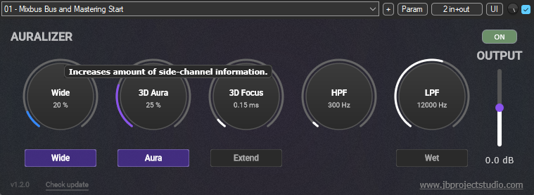

# 🎛️ Auralizer
### Developed by **JB Project Studio**

 

  

---

## 📸 Screenshot

  

---

## 🇮🇹 Descrizione

**Auralizer** è un plugin audio concepito e sviluppato da **JB Project Studio**. È progettato per ottimizzare la percezione dello spazio tridimensionale grazie all'applicazione della **Trasformata di Hilbert**, donando profonda spazialità e impatto sonoro all'interno dei tuoi mix. 

È perfetto per essere utilizzato in Mastering, sul Mixbus, su Bus secondari o su singole tracce. La monocompatibilità rimane matematicamente perfetta: Auralizer non genera artefatti "strani", ma racchiude in un algoritmo *error-free* (a prova di errore) le stesse tecniche avanzate utilizzate quotidianamente nel nostro studio e dai migliori ingegneri di mix e mastering a livello mondiale.

---

## 📘 Mini Guida ai Controlli

* 🎚️ **Wide:** Dotato di uno switch On/Off dedicabile. Non lavora in serie con *3D Aura*, ma si occupa semplicemente di incrementare il volume del segnale Side.
* 🌀 **3D Aura:** Il cuore pulsante della tecnica basata sulla Trasformata di Hilbert, un segreto ingegneristico utilizzato negli studi di alto livello. Il segnale Mid viene ruotato di fase di 90° tramite filtri FIR ad altissima qualità e iniettato direttamente nel Side. Anche questo modulo può essere spento tramite switch On/Off.
* 🎯 **3D Focus:** Lavora in combinazione con *3D Aura*, applicando un ritardo (delay) al suo segnale per offrire una maggiore apertura e una focalizzazione netta sul Mid (un controllo che richiede un ascolto attento). Dispone di due modalità:
  * **Standard:** Versione *Mastering Grade*, per un controllo millimetrico e accurato da 0 a 3 ms di ritardo.
  * **Extend:** Estende il ritardo fino a 15 ms, ideale per scopi creativi su synth, chitarre e strumenti in generale.
* 🎛️ **Filtri Hi-pass e Low-pass:** Permettono di decidere il range di intervento dell'effetto. Il filtro passa-alto non può scendere sotto i 250 Hz (sotto questa soglia l'intervento sarebbe inutile, deleterio e tecnicamente un errore), mentre si ha piena libertà sulle alte frequenze. Questi filtri hanno una pendenza ripidissima calcolata al millesimo. Nel punto di taglio la fase si inverte per ovvie leggi fisiche, ma la pendenza, unita alla rotazione a 90° di *3D Aura*, la riporta in posizione perfetta! In questo modo si evita l'uso di filtri a fase lineare (che causano latenza e pre-ringing) e si riduce l'uso della CPU, mantenendo intatti tutto il punch e la correttezza di fase originari.
* 💧 **Wet:** Consente di ascoltare esclusivamente il segnale processato (solo Wet) per monitorare con precisione l'intervento o per utilizzare il plugin su un bus in parallelo.

### 💡 Consigli sull'Uso
* Il plugin offre un feedback visivo che richiama l'action di *3D Aura* e *Wide*, ma mi raccomando: **non si mixa con gli occhi!**
* Ogni controllo (filtri esclusi), se utilizzato **fino al 50%**, garantisce un risultato perfetto e a prova di errore: il plugin è stato ingegnerizzato specificamente per lavorare in questo range. Oltre il 50% l'algoritmo mantiene un approccio conservativo, ma richiede una maggiore capacità di ascolto.

---

## 🇬🇧 Description

**Auralizer** is an audio plugin conceived and developed by **JB Project Studio**. It is designed to optimize the perception of three-dimensional space utilizing the **Hilbert Transform** technique, adding deep stage width and sonic impact to your mixes. 

Perfectly suited for Mastering, Mixbuses, sub-groups, or individual tracks. Mono-compatibility remains mathematically perfect: Auralizer doesn't introduce "weird anomalies" but applies world-class mixing and mastering techniques—used daily in our studio and by top engineers globally—in a completely *error-free* manner.

---

## 📘 Controls Mini-Guide

* 🎚️ **Wide:** Features a dedicated On/Off switch. It does not run in series with *3D Aura*; it simply boosts the volume of the Side signal.
* 🌀 **3D Aura:** The core of the plugin, powered by the Hilbert Transform technique—an engineering method favored by high-tier pro audio studios. The Mid signal is phase-rotated by 90° via ultra-high-quality FIR filters and injected directly into the Side. This module can also be toggled On/Off.
* 🎯 **3D Focus:** Works in tandem with *3D Aura*, applying a delay to the 3D Aura signal for enhanced width and a sharp focus on the Mid (this control absolutely requires critical listening). It features two modes:
  * **Standard:** *Mastering Grade* version, allowing accurate, millimetric control from 0 to 3 ms of delay.
  * **Extend:** Extends the delay up to 15 ms, ideal for creative effects on synths, guitars, and general instrumentation.
* 🎛️ **Hi-pass and Low-pass Filters:** Let you define the plugin's processing range. The high-pass filter cannot go below 250 Hz (as doing so below this threshold is useless, detrimental, and considered a technical error), while offering total freedom on high frequencies. These filters feature an ultra-steep slope calculated to the millisecond. Although phase inverts at the cutoff point due to laws of physics, the slope combined with the 90° rotation of *3D Aura* realigns the phase into perfect positioning! This eliminates the need for linear-phase filters (which introduce latency and pre-ringing) and reduces CPU usage, preserving maximum punch and native phase correctness.
* 💧 **Wet:** Allows you to listen solely to the processed signal (Wet solo) to accurately audit the processing or to use the plugin on a parallel aux bus.

### 💡 Usage Tips
* The plugin features visual feedback mirroring the action of *3D Aura* and *Wide*, but remember: **don't mix with your eyes!**
* Every control (excluding filters), when used **up to 50%**, guarantees a flawless, error-free result; the plugin was custom-designed to operate this way. Pushing past 50% remains conservative but demands more critical listening.

---

## 📄 License & Copyright
Copyright (c) 2026 **JB Project Studio**. All rights reserved.  
*This software is provided for free personal and commercial audio production use. Redistribution of the binaries without permission is strictly prohibited.*
